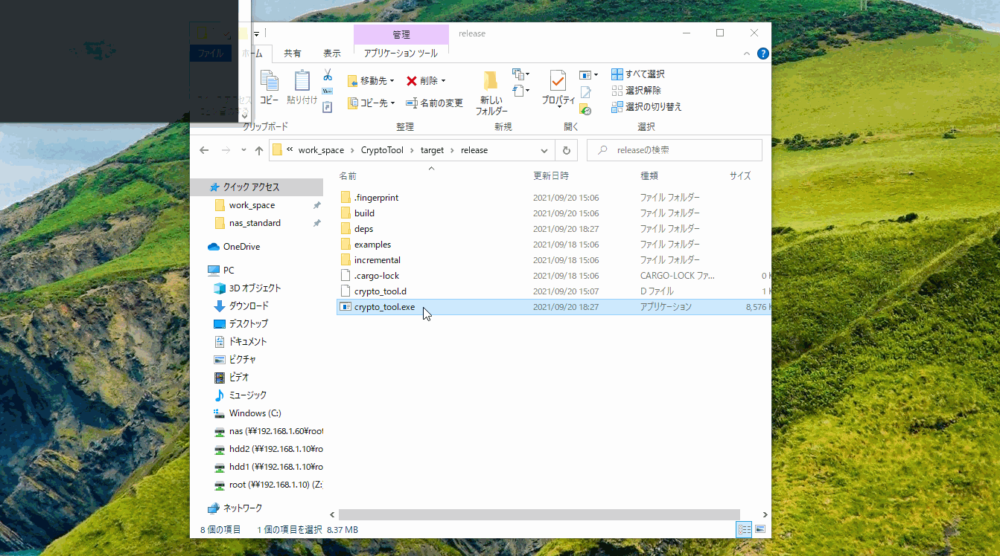

# 暗号化ツール

作成途中のツールです。  
このソフトウェアはMITライセンスになっています。  

- [開発メモ](./document/development_note.md)  
- [ビルド方法](./document/build_note.md)  


### 使い方



### プロジェクトフォルダ構成説明


### コードキュメントについて
以下のコマンドでコードのドキュメントを表示できます。  
```
cargo doc --open
```

詳しい使い方は以下のコマンドで 表示できます。
```
cargo doc -h
```


---
Created on September 19, 2021  
Copyright (c) 2021 Daichi Aoki  
Released under the [MIT license](https://github.com/blz-soft/CryptoTool/blob/main/LICENSE)  