# 暗号化ツール

作成途中のツールです。  
鍵は指定できますが、暗号化時に毎回変更しなければならないナンス(nonce)がソースコードに埋め込まれています。  

### ナンスの扱いについて、、  
ナンスは基本的にファイルに紐づいているもの、、
##### 暗号化  
- ファイルの先頭に付ける
- ファイルを出力する

##### 復号
- ファイルの先頭を読み込む
- ファイルを入力する

#### 考えていること、、
ノンスは12byte  
普通の個人利用ならかぶらないはず?、、  

とりあえず、暗号化するときは、ランダムのノンスを生成して、  
暗号ファイルの最初に追加  
復号の時は、ファイルの最初をとって、ノンスとして使うようにする。  
##### →ノンスをファイルに書き込む方式を実装しました。


### プロジェクトフォルダ構成説明


### コードキュメントについて
以下のコマンドでコードのドキュメントを表示できます。  
```
cargo doc --open
```

詳しい使い方は以下のコマンドで表示できます。
```
cargo doc -h
```

### rustflagについて
ビルドの際は以下のオプションが選べます。(このリポジトリではavx2を使用しています)  
```
This crate contains the following implementations of ChaCha20, all of which work on stable Rust with the following RUSTFLAGS:

x86 / x86_64
avx2: (~1.4cpb) -Ctarget-cpu=haswell -Ctarget-feature=+avx2
sse2: (~2.5cpb) -Ctarget-feature=+sse2 (on by default on x86 CPUs)
Portable
soft: (~5 cpb on x86/x86_64)
NOTE: cpb = cycles per byte (smaller is better)
```

`.cargo/config.toml`の`[]`の中を以下のように修正すると利用できます。  
```
[build]
rustflags = ["-Ctarget-cpu=haswell", "-Ctarget-feature=+avx2"]
```

### 処理フローについて





---
Created on September 19, 2021  
Copyright (c) 2021 Daichi Aoki  
Released under the [MIT license](https://github.com/blz-soft/CryptoTool/blob/main/LICENSE)  